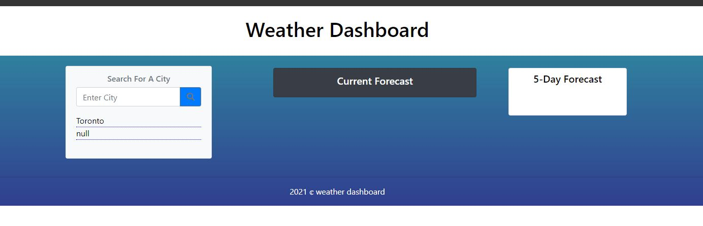
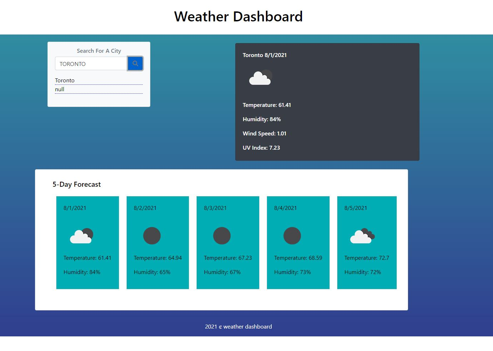

# WEATHER-DASHBOARD
weather dashboard application with HTML, CSS, JavaScript, API, JSON

## USAGE
This is a weather application made to help the usersm to find the current and 5 days in future weather forecast.
in click of a button.
User have to enter a desired city name and search to get weatehr information.

## TECHNOLOGIES
this application made with Wed develepoment technologies such as HTML, CSS , vanilla JAVASCRIPT, JQUERY, BOOTSTRAP , JSON AND THIRD PARTY API.

## REFERENCE AND AKNOWLEDMENT
https://github.com/anik1612/weather-app-by-vanilla-js
https://www.youtube.com/watch?v=OE7kml0pigw&t=126s
https://javascript.plainenglish.io/display-7-day-weather-forecast-with-openweather-api-aac8ba21c9e3
https://www.youtube.com/watch?v=6trGQWzg2AI&t=427s
http://javascriptbook.com/about/

## LIVE DEPLOYMENT
 https://lohithamal.github.io/WEATHER-DASHBOARD/
 
 ## GITHUB REPO
 https://github.com/LohithAmal/WEATHER-DASHBOARD

# APP IMAGES

